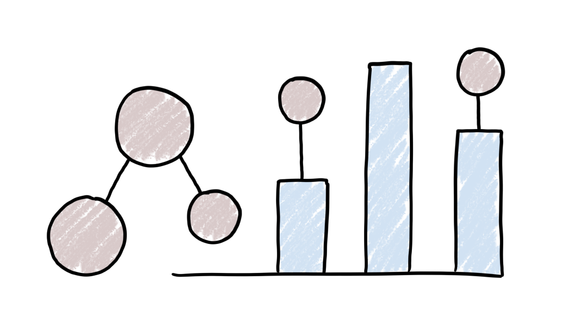
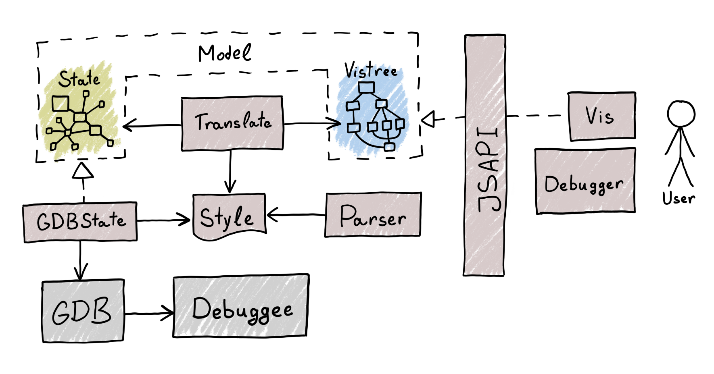

Prototype semantic visual debugger developed at the
[Faculty of Information Technology, Czech Technical University in Prague](https://fit.cvut.cz/en).

## How It Works

Aili builds on abstraction to separate the debuggee from the visuals
presented to the user. At its core, a stylesheet provided by the user
specifies how each part of the debuggee should be represented graphically.

The stylesheets are loosely based on [CSS](https://developer.mozilla.org/en-US/docs/Web/CSS).
They are intentionally similar in some syntactic constructs, which may help introduce
a user who is familiar with CSS, but they also differ in many aspects.
See the [stylesheet authors' manual](./doc/stylesheets.md) for more information.

## Modules in This Repository

| Language + Module               | Description                                                     |
|---------------------------------|-----------------------------------------------------------------|
| [:yellow_square: Debugger](./debugger) | Demo application that showcases the whole debugger pipeline. |
| [:yellow_square: Demo](./demo)  | Demo application that showcases Vis and Translate modules.      |
| [:crab: GDBState](./gdbstate)   | Implementation of the Program State model for C that uses the [GNU Project Debugger](https://www.sourceware.org/gdb). |
| [:yellow_square: Hooligan](./hooligan) | Hooking and logging utilities.                           |
| [:yellow_square::crab: JSAPI](./jsapi) | Bindings between modules written in Rust and Javascript. |
| [:crab: Model](./model)         | Definitions of Program State and Visualization models.          |
| [:crab: Parser](./parser)       | Parser for stylesheets of the Style module.                     |
| [:crab: Style](./style)         | Stylesheets that assign properties to State entities.           |
| [:crab: Translate](./translate) | Translator for converting between Program state and Visualization models based on a stylesheet that describes the mapping. |
| [:yellow_square: Vis](./vis)    | Browser-based renderer of Visualization model, written in Typescript. |

## References

[Companion paper of version 0.1.0]

Čajan Tomáš. *Interactive debugger with semantic visualization*.
Bachelor’s thesis. Czech Technical University in Prague, Faculty of Information
Technology, 2025. URL: http://hdl.handle.net/10467/123265.

## Acknowledgements

This software was developed with the support of the Faculty of Information Technology,
Czech Technical University in Prague, [fit.cvut.cz](https://fit.cvut.cz)

