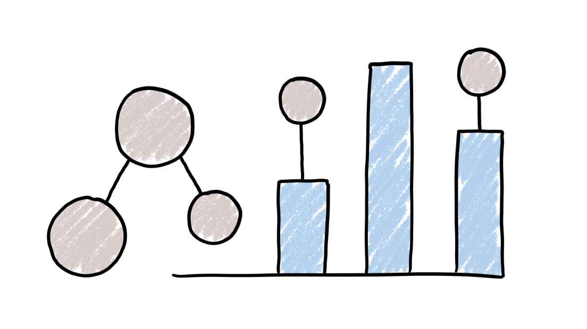

Prototype semantic visual debugger.

## Modules in This Repository

| Module                          | Description                                                     |
|---------------------------------|-----------------------------------------------------------------|
| [:yellow_square: Demo](./demo)  | Demo application that showcases Vis and Translate modules.      |
| [:yellow_square::crab: JSAPI](./jsapi) | Bindings between modules written in Rust and Javascript. |
| [:crab: Model](./model)         | Definitions of Program State and Visualization models.          |
| [:crab: Parser](./parser)       | Parser for stylesheets of the Translate module.                 |
| [:crab: Translate](./translate) | Translator for converting between Program state and Visualization models based on a stylesheet that describes the mapping. |
| [:yellow_square: Vis](./vis)    | Browser-based renderer of Visualization model, written in Typescript. |
