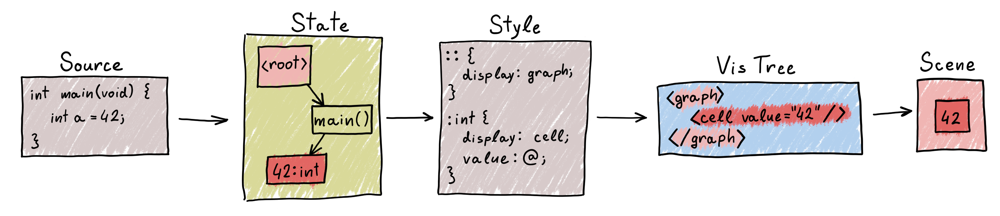

# Aili Stylesheet Authors' Manual

Aili's stylesheets are what makes its diverse, customizable visualizations
possible. They are loosely based on [CSS](https://developer.mozilla.org/en-US/docs/Web/CSS),
which may help introduce a user who is familiar with CSS, but they also differ
in many aspects.

Aili resolves its stylesheets over a graph model that represents
the debuggee's internal state. The output of this resolution
is a different tree-like model that represents a visual scene that can
be presented to a user.



## Contents

- [Stylesheets Basics](#stylesheets-basics)
- [Selectors](#selectors)
  - [List of Matchers](#list-of-matchers)
  - [Pseudo-Elements](#pseudo-elements)
  - [Examples](#examples)
- [Properties](#properties)
  - [`display`](#display)
  - [`parent`](#parent)
  - [`target`](#target)
  - [Model Attributes](#model-attributes)
- [Variables](#variables)
  - [Variable Visibility](#variable-visibility)
- [Select Expressions](#select-expressions)
- [Visual Models](#visual-models)
  - [Text](#text)
  - [Cell](#cell)
  - [Label](#label)
  - [Checkbox](#checkbox)
  - [Row](#row)
  - [Graph](#graph)
  - [Connector](#connector)
- [Memory Hint Sheets](#memory-hint-sheets)

## Stylesheets Basics

A stylesheet is composed of rules. Each rule has a *selector*
that describes which entities the rule applies to.
These selected entities will then be assigned properties
that describe what they should look like.
Arithmetic expressions are permitted on the right-hand
sides of assignments.

Starting with the example from the leading illustration,
this is what it exactly means:
```css
/* Select the root scope */
:: {
    /* Render the scene as a graph */
    display: graph;
}

/* Select all variables of type int */
:int {
    /* Render the variable as a box with text inside */
    display: cell;
    /* Print the variable's value into the visual */
    value: @;
}
```

The root scope is particularly important - its `display` property
must be specified because it determines the layout of the
container of the visual scene.
This means all stylesheets will start with something along the lines of
```css
:: {
    display: graph;
}
```

In case of a conflict, the latter rule always takes priority.
```css
:int {
    display: cell;
}

:int {
    /* This rule takes priority because it comes later in the stylesheet */
    display: text;
}
```

This is useful for defining fallback values. For example:
```css
:int {
    /* Display the variable in black text */
    color: black;
}

:int.if(@ == 0) {
    /* If the variable's value is exactly zero, use blue text instead */
    color: blue;
}
```

## Selectors

The selectors in the first few examples only targeted a specific entity.
Similarly to CSS, a selector can specify a whole path that leads up
to the entity of interest.
```css
/* Select all variables named "a" */
"a" {}

/* Select all items of an array stored in a global variable named "things" */
:: "things" [] {}
```

This also permits some degenerate selectors.
```css
/* Select all entities (that's an empty selector) */
{}

/* Select all entities except the root scope */
* {}
```

For performance reasons, each selector is only allowed to scan any given entity once.
This can be relevant when using [variables](#variables), as they may be affected
by the full path that the selector has matched.

### List of Matchers

Selectors can be assembled from the following matchers that are known to Aili.
| Matcher        | Description |
|----------------|-------------|
| `*`            | Selects anything except the root scope. |
| `main`         | Selects the scope of the entry point. |
| `next`         | Selects the scope of a function call from the current frame. |
| `ret`          | Selects the return value of a function, if it is available. This selector is not supported by the current prototype of Aili. |
| `%`            | Selects all named variables. |
| `"a"`          | Selects all variables named "a". |
| `"a"#0`        | Selects all variables named "a". If there are multiple in the same scope, only the first one is selected. This is intended to serve as a last-resort measure when there are multiple variables of the same name declared in the same function, and a specific one needs to be selected. |
| `[]`           | Selects all array items. |
| `[0]`          | Selects the first item of any array. |
| `[`*(expr)*`]` | Evaluates the expression and selects an array item at the given index. If the expression does not evaluate to a non-negative integer, does not select anything. This matcher desugars to `[].if(--INDEX == `*(expr)*`)`. |
| `len`          | Selects a special entity that indicates the length of an array. |
| `ref`          | Selects objects that are pointed to by a pointer or reference. |
| `:root`        | Selects the root scope. This matcher desugars to `.if(is-root(@))`. |
| `:frame`       | Selects the scopes of functions. This matcher desugars to `.if(is-frame(@))`. |
| `:val`         | Selects all elementary values. This matcher desugars to `.if(is-val(@))`. |
| `:struct`      | Selects all structured values. This matcher desugars to `.if(is-struct(@))`. |
| `:arr`         | Selects all array values. This matcher desugars to `.if(is-arr(@))`. |
| `:ref`         | Selects all pointer/reference values. This matcher desugars to `.if(is-ref(@))`. |
| `:hello`       | Selects all values of type "hello" and all scopes of calls to a function named "hello". This matcher desugars to `.if(typename(@) == "hello")`. |
| `:"frame"`     | Selects all values of type "frame" and all scopes of calls to a function named "frame". Quotations can be used to escape the name of the type if it is one of the special values or if it is not an identifier. |
| `.if(`*(expr)*`)` | Aborts the selector unless *(expr)* evaluates to a truthy value. |
| `.many(`*(selector)*`)` | Matches *(selector)* zero or more times in a row. |
| `.alt(`*(selector), ...*`)` | Selects anything that is selected by at least one of the selectors. |

The matchers `*`, `main`, `next`, `ret`, `%`, `"a"`, `"a"#0`, `[]`, `[...]`,
`len`, and `ref` shift the selection context to a different entity,
and all following matchers are then evaluated in the context of that entity.
`"a":node` matches a variable named "a" of type "node", while `:node "a"`
matches a member variable named "a" of a variable of type "node".

### Pseudo-Elements

By default, all selectors match a scope or a value
and turn it into one visual element.
There are two pseudo-elements (think pseudo-elements from CSS,
the idea is similar) that can change this behavior.

| Pseudo-element | Description |
|----------------|-------------|
| `::edge`       | Instead of selecting a scope or value, the selector selects the relation between two scopes or values and attaches a visual element to that. |
| `::extra` or `::extra(`*(token)*`)` | Instead of attaching the visual element to the selected entity, an additional visual element is created that represents the same entity in the debuggee. This can be stacked with `::edge`. |

### Examples

```css
/* Selects the scopes of all functions that are currently executing */
:: main .many(next) {}

/* Selects the length of a global array named "things" */
:: "things" len {}

/* Selects the object pointed to by a pointer variable named "head" */
"head" ref {}

/* Selects all elementary variables declared in the main function */
:: main %:val {}

/* Selects global variables named "a" and "b" */
:: .alt("a", "b") {}

/* Selects the scopes of all calls to function named "do_thing" */
:frame:"do_thing" {}
```

## Properties

This section describes properties available in the translator stylesheets.
[Memory hint sheets](#memory-hint-sheets) are described in their own section.

### `display`

Affects whether the entity will be visualized,
and if so, what kind of visual entity will be used.

The value assigned to this property is coerced to a string
and the [visual model](#visual-models) of that name will be used
to visualize the entity.

If a value of `none` or `unset` is assigned, the entity will not be rendered.
This is the default value.

```css
:: {
    /* Will be rendered using the graph model */
    display: graph;
}

:int {
    /* Will be rendered using the cell model */
    display: cell;
}

:"implementation_details" {
    /* Will not be rendered */
    display: none;
}
```

### `parent`

Specifies the placement of the entity's visualization within the scene.

By default, the structure of the visual scene mirrors that of the debuggee's state.
This is not always desirable, as some visualizations have different structure
than the program they represent. In those cases, this property may be used
to override the placement of visualizations.

These properties only affect visual placements. Selector resolution
is not affected in any way.

```css
:: {
    /* A common pattern is to store a reference to the root scope in a variable... */
    --root: @;
}

* {
    /* ...and then move all other scopes and objects directly into the root */
    parent: --root;
}
```

### `target`

Has a similar role to [`parent`](#parent).
Specifies the *target* of an entity whose `display` is set to `connector`.

```css
:ref {
    /* Display reference variables as connectors */
    display: connector;
    /* Source is already implicitly the parent of the variable.
     * Target will be the value that the reference points to */
    target: @(ref);
}
```

### Model Attributes

All other properties are forwarded to the [visual model](#visual-models)
specified by [`display`](#display).

## Variables

Identifiers that start with a `--` (double dash) are interpreted as variable names.
Values assigned to these may be recalled by following clauses in the same rule or,
in some cases, by the selectors and clauses of other rules
(see [Variable Visibility](#variable-visibility)).

```css
:: {
    --a: red;    /* Set a variable */
    color: --a;  /* ...and recall it later */
}

:: main {
    /* In some cases, variables may be recalled
     * by other rules, although this is not always guaranteed */
    color: --a;
}
```

### Variable Visibility

Variables are visible only on the same path as they are declared.
Once the stylesheet resolver backtracks, declared variables are lost.

As a general rule of thumb, a variable is guaranteed to be visible
in a rule whose selector contains as a prefix the selector of the rule
that declared it.

```css
:node "next" {
    --a: 0;
}

:node "next" ref {
    value: --a; /* --a is guaranteed to exist here */
}
```

In particular, variables declared in the root scope are always
guaranteed to propagate everywhere.

```css
:: {
    /* All rules can see this */
    --a: 0;
}
```

## Select Expressions

Stylesheets support common arithmetic expressions.
In addition, a unique construct is a select expression,
which allows an expression to reference an entity.

The select expression starts with a `@`, optionally followed by
a parenthesized path constructed from a limited subset of selector matchers.

The simplest use case is to retrieve a reference to the current entity.

```css
:int {
    /* Print the value of the variable into the visual that represents it */
    value: @;
}

:int.if(@ == 0) {
    /* Render the variable in blue if it is equal to zero */
    color: blue;
}
```

Other variables can be selected by navigating to them via a selector.
The selector must uniquely select at most one entity, so only
the `main`, `next`, `ret`, `"a"#0`, `[`*(expr)*`]`, `len`, and `ref`
matchers are permitted. `"a"` (without the discriminator)
are allowed too, but they desugar to `"a"#0`.

```css
:point {
    /* Set the "x" property to equal the value of the "x" member variable */
    x: @("x");
}
```

By default, the select expressions are evaluated starting at the current entity.
This can be overridden by explicitly setting an origin. This is rarely necessary,
but it is sometimes needed when variables are used as array indices.

```css
:: main {
    --array: @("array");
}

/* The visual that represents the variable "i" will be attached
 * to the array item at the index given by its own value */
:: main "i" {
    parent: @((--array) [@]);
}
```

## Visual Models

Visual models represent different ways that data can be visualized.
Which visual model should be used is decided by the [`display`](#display)
property.

Visual models are not defined by the stylesheets themselves,
but the current frontend supports the following models:

### Text

Simple text label.

```css
:int {
    display: text;
    value: "";     /* Text content of the label */
    color: black;  /* Text color */
}
```

### Cell

Box with an optional text label inside.

```css
:int {
    display: cell;
    value: "";           /* Text content of the cell */
    stroke-style: solid; /* solid, dashed, or dotted */
    stroke-width: 1;     /* Width of the outline in pixels */
    stroke: black;       /* Color of the outline */
    fill: black;         /* Fill color */
    color: black;        /* Text color */
    size: 2;             /* Minimum size of the cell, in em units */
    shape: square;       /* square, circle, or rounded */
}
```

### Label

Label that does not isert itself into its parent's layout,
but positions itself near the parent without affecting it
(`position: absolute` in CSS).
Because of this, it can even be the child of elements that
have no internal structure and do not normally render children,
such as [Text](#text), [Cell](#cell), or other Labels.

```css
:int {
    display: label;
    value: "";                  /* Text content of the label */
    color: black;               /* Text color */
    vertical-justify: center;   /* start, center, or end;
                                 * the justification relative to parent element */
    horizontal-justify: center; /* start, center, or end;
                                 * the justification relative to parent element */
    vertical-align: inside;     /* inside, outside, or middle;
                                 * the alignment relative to the parent's edge */
    horizontal-align: inside;   /* inside, outside, or middle;
                                 * the alignment relative to the parent's edge */
    hat: none;                  /* north, east, south, or west;
                                 * places a small triangle at the chosen side of the label */
    padding: 0;                 /* Space between the label and its parent's edge, in em units */
}
```

### Checkbox

Checkbox.

```css
:bool {
    display: checkbox;
    checked: false;
}
```

### Row

Container that lays out its children in a row or column
(CSS flex container).

```css
:arr {
    display: row;
    stroke-style: solid; /* solid, dashed, or dotted */
    stroke-width: 1;     /* Width of the outline in pixels */
    stroke: black;       /* Color of the outline */
    fill: black;         /* Fill color */
    padding: 0;          /* Space around the children, in em units */
    gap: 0;              /* Space between any two children, in em units */
    direction: row;      /* row or column */
    align-items: center; /* start, center, or end;
                          * alignment of children perpendicular to the main axis */
}

:arr [] {
    order: 0; /* Order of the child relative to others */
}
```

### Key-Value Table

Container that has a separate row with a label for each of its children.

```css
:struct {
    display: kvt;
    title: ""; /* Heading of the table */
}

:struct % {
    key: ""; /* Label attached to the child */
}
```

### Graph

Container that lays out its children depending on the presence of
[connectors](#connector) between them.

```css
:: {
    display: graph;
    layout: unoriented;  /* unoriented, layered, or
                          * gv-dot, gv-neato, gv-circo, gv-twopi, or gv-fdp
                          * for explicit models when using Graphviz as the layout engine */
    stroke-style: solid; /* solid, dashed, or dotted */
    stroke-width: 1;     /* Width of the outline in pixels */
    stroke: black;       /* Color of the outline */
    fill: black;         /* Fill color */
    padding: 0;          /* Space around the children, in em units */
    gap: 0;              /* Preferred distance between children, in pixels */
    direction: row;      /* north, east, south, or west;
                          * the direction in which the graph should expand
                          * if layout is layered */
}

* {
    order-children: false; /* Enables the forced order of outgoing edges */
}

::edge {
    display: connector;
    order: /* If parent has order-children set, specifies the order relative
            * to its other outgoing edges */
}
```

### Connector

Special kind of visual entity that connects two other entities.

```css
::edge {
    display: connector;
    stroke-style: solid;    /* solid, dashed, or dotted */
    stroke-width: 1;        /* Width of the line in pixels */
    stroke: black;          /* Color of the line */
    label: "";              /* Label at the center of the connector */
    shape: straight;        /* straight, square, quadratic, or cubic */
    start/label: "";        /* Label at an end point of the connector */
    start/anchor: auto;     /* Position within the endpoint element
                             * where the connector attaches
                             * auto, north, south, east, west,
                             * northeast, northwest, southeast, or southwest */
    start/decoration: none; /* square, circle, or arroe */
    /* Analogously for end/... */
}
```

## Memory Hint Sheets

In C, it is not possible to tell at run time whether a pointer
points to a single object, or an array.
To avoid the uncertainity of heuristic workarounds,
it is up to the user to specify which pointers are to arrays.

These memory hints are also provided through stylesheets, although
they are separate from the visualization stylesheets
as they are resolved at a different stage of the Aili pipeline.
[Properties](#properties) listed above are not available here.
Instead, a `length` property can be assigned.

Pointers are, by default, assumed to point to single objects.
Setting the `length` property to a number (or the reference
to a node with a numeric value) indicates that an array
should be assumed instead.

```css
:vector {
    /* Save the length of the buffer in a variable */
    --length: @("capacity");
}

:vector "buffer" {
    /* ...and use it as the length of the buffer */
    length: --length;
}
```

The idea is that a dynamically allocated array will probably be accompanied
by a variable that keeps track of its length.

Currently, it is not possible for the stylesheets to cross
a dereference boundary - the variable that knows the length
has to be in the same memory block as the pointer.

## References

*MDN Web Docs*. CSS: Cascading Style Sheets [online]. 2025-03-22.
[acc. 2025-05-12]. url: https://developer.mozilla.org/en-US/docs/Web/CSS.

*cppreference* [online]. 2025-03-30. [acc. 2025-05-08]. url:
https://en.cppreference.com/w.

*Graphviz* [online]. 2021-08-10. [acc. 2025-05-13]. url:
https://graphviz.org/.
