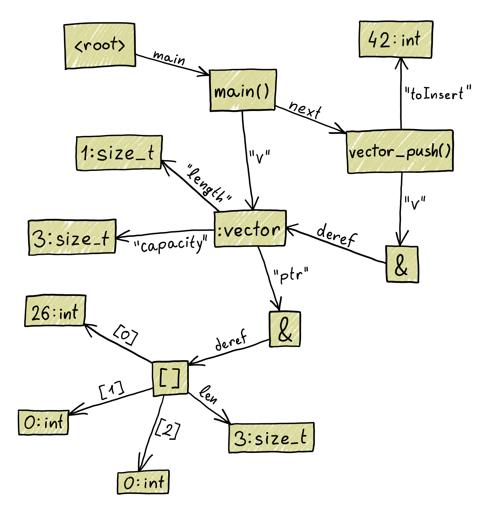
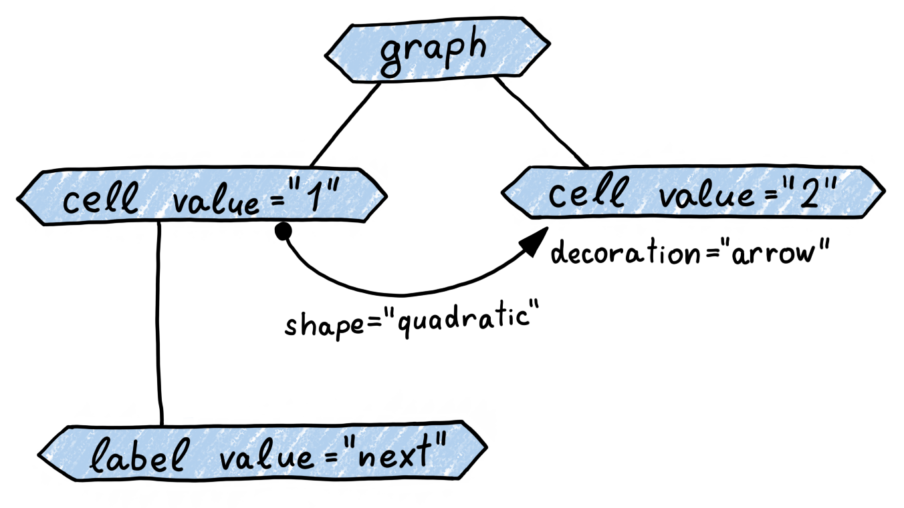

# Aili-Model

Defines the abstract models that form the interface between
the main modules of Aili.

## State Graph

The State graph model represents the internal state of a debuggee
with a language-independent graph structure.



## Visualization Tree

The Visualization tree model represents a scene that should be presented
to a user in an XML-like format where connectors can be added
between any two elements.



## Documentation

The following command generates documentation and saves it
in the target directory.

```sh
cargo doc --no-deps
```
